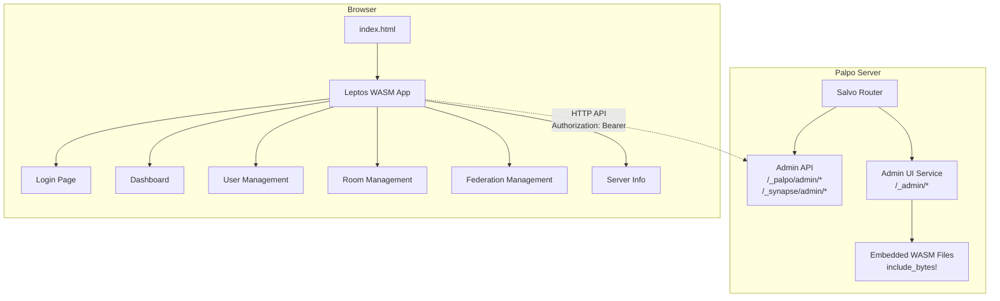

## 产品概述

Palpo Admin UI 是一个基于 Leptos WASM 框架的嵌入式管理界面，为 Palpo Matrix Homeserver 提供可视化的管理功能。

## 用户选择确认

- **前端框架**：Leptos 0.7+（现代响应式 WASM 框架，性能顶级）
- **UI 风格**：Ant Design + 深色主题 + 玻璃态效果
- **部署方式**：嵌入式 WASM（与 Palpo 服务器一体化）
- **优先功能**：

1. 用户管理（列表/搜索/详情/编辑）
2. 房间管理（列表/搜索/详情/删除）
3. 服务器状态监控（运行状态/统计）
4. 联邦管理（联邦服务器状态监控）

## 基于 API 能力的功能规划

### 已实现的 API 功能（第一阶段实现）

| 模块 | 可用功能 |
| --- | --- |
| **用户管理** | 用户列表/搜索/排序、创建/编辑用户、停用/启用账户、密码重置、设管理员、影子封禁、暂停账户、速率限制、whois 查询、加入的房间列表、推送器列表、账户数据查询 |
| **设备管理** | 设备列表、创建设备、删除设备、批量删除、更新设备信息 |
| **房间管理** | 房间列表/搜索/排序、房间详情、成员列表、状态事件、消息历史、封禁/解封、删除房间、层级结构、前向极端事件诊断 |
| **联邦管理** | 目标服务器列表、详情查看、重置连接、共享房间查询 |
| **事件查询** | 通过事件 ID 获取事件详情 |
| **用户查找** | 通过 3PID（邮箱/手机号）查找、通过外部 ID（SSO/OIDC）查找 |
| **服务器信息** | 版本查询 |


### API 未实现功能（暂不支持）

| 模块 | 状态 | 说明 |
| --- | --- | --- |
| **媒体管理** | 不可用 | 用户媒体列表、媒体删除等 API 返回 501 |
| **事件举报** | 不可用 | 举报列表、举报处理 API 返回 501 |
| **服务器通知** | 不可用 | 发送服务器通知 API 返回 501 |
| **定时任务** | 不可用 | 定时任务列表 API 返回 501 |
| **媒体统计** | 不可用 | 用户媒体使用统计 API 返回 501 |
| **配置管理** | 有限支持 | 无直接修改配置 API，配置通过 TOML 文件管理，UI 仅展示 |


## 核心功能需求

### 1. 登录认证

- 管理员登录页面，通过 Matrix 身份验证获取 access token
- 调用 `POST /_matrix/client/v3/login`
- 使用 localStorage 存储 token
- 自动 token 过期检测

### 2. Dashboard 首页

- 统计卡片：用户总数、房间总数、联邦服务器数、服务器版本
- 近期注册用户列表（前 10 条）
- 快捷操作入口

### 3. 用户管理

- 用户列表（分页/搜索/筛选/排序）
- 筛选条件：用户类型（全部/管理员/访客）、状态（活跃/停用/锁定）
- 用户详情抽屉：基本信息、ThreePIDs、外部 IDs、设备列表、加入的房间、推送器、账户数据
- 用户操作：编辑、停用/启用、锁定/解锁、重置密码、设管理员、影子封禁、暂停、删除

### 4. 房间管理

- 房间列表（分页/搜索/筛选/排序）
- 筛选条件：房间类型（全部/公开/私密）、加密状态
- 房间详情抽屉：基本信息、成员列表、状态事件、消息历史、层级结构
- 房间操作：封禁/解封、删除房间

### 5. 联邦管理

- 联邦服务器列表（分页/搜索）
- 服务器详情：连接状态、重试信息、失败时间
- 共享房间列表
- 操作：重置连接

### 6. 服务器信息

- 只读展示当前服务器配置概览
- 版本信息、服务器名称、监听地址等基础信息

## 视觉设计需求

- **主题**：深色主题（#141414, #1F1F1F, #2B2B2B）
- **主色调**：Ant Design 蓝色系（#1677FF, #0958D9, #4096FF）
- **功能色**：成功 #52C41A、错误 #FF4D4F、警告 #FAAD14
- **字体**：PingFang SC（中文优化）
- **效果**：玻璃态（Glassmorphism）+ 微动画
- **布局**：侧边栏导航 + 顶部栏 + 内容区卡片布局

## 技术栈选择

### 前端技术栈

| 技术 | 版本 | 用途 |
| --- | --- | --- |
| **Leptos** | 0.7+ | 响应式 WASM 框架 |
| **leptos_router** | 0.7+ | 客户端路由（内置） |
| **gloo-net** | 0.6+ | WASM HTTP 客户端 |
| **gloo-storage** | 0.3+ | localStorage 操作 |
| **serde** | 1.0+ | 序列化/反序列化 |
| **wasm-bindgen** | 0.2+ | WASM/JS 绑定 |
| **web-sys** | 0.3+ | Web API 绑定 |
| **Tailwind CSS** | 3.4+ | 原子化样式 |
| **lucide-leptos** | latest | 图标组件 |


### 后端集成

- **静态文件服务**：Salvo `StaticDir` + `include_bytes!` 嵌入
- **API 端点**：复用现有 `/_palpo/admin/*` 和 `/_synapse/admin/*`
- **认证中间件**：复用 `hoops::auth_by_access_token` + `require_admin`
- **CORS**：已配置允许任意 Origin

## 实现方案

### 架构设计



### 目录结构

```
palpo/
├── crates/
│   ├── server/
│   │   └── src/
│   │       ├── main.rs              # [MODIFY] 添加 UI 路由
│   │       ├── routing.rs           # [MODIFY] 集成 admin UI 路由
│   │       └── ui_service.rs        # [NEW] 静态文件服务
│   └── ui/                          # [NEW] Leptos 项目
│       ├── Cargo.toml
│       ├── index.html
│       ├── Trunk.toml
│       ├── style.css                # Tailwind 入口
│       └── src/
│           ├── main.rs              # WASM 入口
│           ├── lib.rs               # 库导出
│           ├── app.rs               # 根组件 + 路由配置
│           ├── components/          # 可复用组件
│           │   ├── layout.rs        # 侧边栏 + 顶部栏布局
│           │   ├── data_table.rs    # 数据表格组件
│           │   ├── modal.rs         # 模态框组件
│           │   ├── drawer.rs        # 抽屉组件
│           │   ├── form.rs          # 表单组件
│           │   ├── stats_card.rs    # 统计卡片
│           │   └── breadcrumb.rs    # 面包屑导航
│           ├── pages/               # 页面组件
│           │   ├── login.rs         # 登录页
│           │   ├── dashboard.rs     # Dashboard 首页
│           │   ├── users.rs         # 用户管理
│           │   ├── rooms.rs         # 房间管理
│           │   ├── federation.rs    # 联邦管理
│           │   └── server_info.rs   # 服务器信息
│           ├── services/            # API 客户端
│           │   ├── api.rs           # HTTP 客户端封装
│           │   ├── auth.rs          # 认证 API
│           │   ├── users.rs         # 用户 API
│           │   ├── rooms.rs         # 房间 API
│           │   ├── federation.rs    # 联邦 API
│           │   └── server.rs        # 服务器 API
│           ├── types/               # 数据类型
│           │   ├── user.rs          # 用户相关类型
│           │   ├── room.rs          # 房间相关类型
│           │   ├── federation.rs    # 联邦相关类型
│           │   └── common.rs        # 通用类型
│           └── state/               # 全局状态
│               ├── auth.rs          # 认证状态
│               └── app.rs           # 应用状态
├── Cargo.toml                       # [MODIFY] 添加 ui member
└── build.rs                         # [NEW] 构建脚本（嵌入资源）
```

### 关键 API 集成

**认证 API：**

- `POST /_matrix/client/v3/login` - 登录获取 token

**用户管理 API：**

- `GET /_synapse/admin/v2/users` - 用户列表
- `GET /_synapse/admin/v2/users/{user_id}` - 用户详情
- `PUT /_synapse/admin/v2/users/{user_id}` - 创建/修改用户
- `POST /_synapse/admin/v1/deactivate/{user_id}` - 停用用户
- `POST /_synapse/admin/v1/reset_password/{user_id}` - 重置密码
- `PUT /_synapse/admin/v1/users/{user_id}/admin` - 设置管理员
- `POST/DELETE /_synapse/admin/v1/users/{user_id}/shadow_ban` - 影子封禁
- `PUT /_synapse/admin/v1/suspend/{user_id}` - 暂停账户
- `GET /_synapse/admin/v1/whois/{user_id}` - 用户会话信息
- `GET /_synapse/admin/v1/users/{user_id}/joined_rooms` - 加入的房间
- `GET /_palpo/admin/v2/users/{user_id}/devices` - 设备列表

**房间管理 API：**

- `GET /_synapse/admin/v1/rooms` - 房间列表
- `GET /_synapse/admin/v1/rooms/{room_id}` - 房间详情
- `GET /_synapse/admin/v1/rooms/{room_id}/members` - 成员列表
- `GET /_synapse/admin/v1/rooms/{room_id}/state` - 状态事件
- `GET /_synapse/admin/v1/rooms/{room_id}/messages` - 消息历史
- `PUT /_synapse/admin/v1/rooms/{room_id}/block` - 封禁/解封
- `DELETE /_palpo/admin/v2/rooms/{room_id}` - 删除房间

**联邦管理 API：**

- `GET /_synapse/admin/v1/federation/destinations` - 服务器列表
- `GET /_synapse/admin/v1/federation/destinations/{destination}` - 详情
- `GET /_synapse/admin/v1/federation/destinations/{destination}/rooms` - 共享房间
- `POST /_synapse/admin/v1/federation/destinations/{destination}/reset_connection` - 重置连接

**服务器信息 API：**

- `GET /_synapse/admin/v1/server_version` - 版本信息

### 服务器端 UI 服务

**crates/server/src/ui_service.rs：**

```rust
use salvo::prelude::*;

// 开发模式：从文件系统加载
#[cfg(debug_assertions)]
pub fn router() -> Router {
    Router::with_path("_admin")
        .get(serve_index_dev)
        .push(Router::with_path("{*path}").get(serve_static_dev))
}

// 生产模式：从嵌入资源加载
#[cfg(not(debug_assertions))]
pub fn router() -> Router {
    Router::with_path("_admin")
        .get(serve_index_prod)
        .push(Router::with_path("{*path}").get(serve_static_prod))
}

// 嵌入的静态资源
#[cfg(not(debug_assertions))]
static INDEX_HTML: &[u8] = include_bytes!("../../ui/dist/index.html");
```

### 构建流程

**开发模式：**

```
# 终端 1: 启动 Palpo 服务器
cargo run -p palpo

# 终端 2: 启动 Leptos 开发服务器
cd crates/ui && trunk serve --port 8080
```

- UI 访问：http://localhost:8080
- API 代理到 http://localhost:8008

**生产构建：**

```
# 构建 UI
cd crates/ui && trunk build --release

# 构建 Palpo（包含嵌入的 UI）
cargo build -p palpo --release

# 运行
./target/release/palpo
```

- UI 访问：http://localhost:8008/_admin

采用 Ant Design 设计体系，结合现代化的深色主题和玻璃态效果，打造专业、高效的管理界面。Leptos 的细粒度响应式特性确保界面流畅交互。

### 页面布局结构

- **侧边栏导航**（固定左侧，宽 256px）：
- Logo 区域（Palpo 品牌标识）
- 导航菜单（Dashboard、用户、房间、联邦、服务器信息）
- 底部用户信息（头像、用户名、退出按钮）

- **顶部栏**（固定顶部，高 64px）：
- 面包屑导航
- 全局搜索框
- 通知图标
- 用户头像下拉菜单

- **内容区**（自适应剩余空间）：
- 页面标题和操作按钮
- 筛选栏（搜索、过滤器、刷新）
- 数据卡片/表格
- 分页组件

### 页面详细设计

1. **登录页**：

- 全屏深色背景 + 玻璃态登录卡片
- 居中布局，卡片宽 400px
- 服务器地址输入（可选，默认当前域名）
- 用户名/密码输入框
- 记住登录状态复选框
- 登录按钮（加载状态）
- 错误提示 Toast

2. **Dashboard 首页**：

- 四列统计卡片（用户总数、房间总数、联邦服务器数、服务器版本）
- 卡片使用玻璃态效果，悬停微上浮动画
- 近期注册用户列表（前 10 条）
- 快捷操作按钮（创建用户、查看日志等）

3. **用户管理页**：

- 筛选栏：搜索框、用户类型筛选（全部/管理员/访客）、状态筛选（活跃/禁用/锁定）
- 数据表格：ID、用户名、显示名、注册时间、状态、操作列
- 操作列：查看、编辑、禁用、删除（下拉菜单）
- 分页：每页 20/50/100 条可选
- 用户详情抽屉：从右侧滑出，展示完整信息、设备列表、加入的房间、推送器

4. **房间管理页**：

- 筛选栏：搜索框、房间类型（全部/公开/私密）、加密状态筛选
- 数据表格：ID、房间名、成员数、版本、创建者、操作列
- 操作列：查看、封禁、删除
- 房间详情抽屉：成员列表、状态事件、消息历史、层级结构

5. **联邦管理页**：

- 筛选栏：搜索框、连接状态筛选
- 数据表格：服务器名称、状态、最后成功时间、操作列
- 操作列：查看详情、重置连接
- 服务器详情抽屉：连接信息、共享房间列表

6. **服务器信息页**：

- 只读展示服务器配置概览
- 分组展示：基础信息、监听配置、数据库配置等
- 版本信息卡片

## 实施任务列表

| 序号 | 任务 ID | 任务内容 | 依赖 | 状态 |
| --- | --- | --- | --- | --- |
| 1 | explore-api | 探索现有 Admin API 端点和数据结构，生成 API 文档 | - | ⏳ 待开始 |
| 2 | create-ui-crate | 创建 crates/ui 目录结构和 Cargo.toml 配置 | explore-api | ⏳ 待开始 |
| 3 | setup-leptos | 初始化 Leptos 项目，配置 Trunk 和 Tailwind CSS | create-ui-crate | ⏳ 待开始 |
| 4 | auth-module | 实现登录页面和认证状态管理模块 | setup-leptos | ⏳ 待开始 |
| 5 | layout-components | 实现布局组件（侧边栏、顶部栏、页面框架） | auth-module | ⏳ 待开始 |
| 6 | api-client | 实现 API 客户端封装（users, rooms, federation, server） | auth-module | ⏳ 待开始 |
| 7 | dashboard-page | 实现 Dashboard 首页和统计卡片组件 | layout-components, api-client | ⏳ 待开始 |
| 8 | user-management | 实现用户管理页面（列表、搜索、详情抽屉、编辑） | layout-components, api-client | ⏳ 待开始 |
| 9 | room-management | 实现房间管理页面（列表、搜索、详情抽屉、操作） | layout-components, api-client | ⏳ 待开始 |
| 10 | federation-management | 实现联邦管理页面（服务器列表、详情、重置连接） | layout-components, api-client | ⏳ 待开始 |
| 11 | server-info | 实现服务器信息展示页面（只读配置概览） | layout-components, api-client | ⏳ 待开始 |
| 12 | ui-service | 实现服务器端 UI 静态文件服务模块（开发/生产双模式） | - | ⏳ 待开始 |
| 13 | integrate-server | 将 UI 集成到 Palpo 服务器路由 | dashboard-page, user-management, room-management, federation-management, server-info, ui-service | ⏳ 待开始 |
| 14 | build-deploy | 配置构建流程，实现嵌入式部署脚本 | integrate-server | ⏳ 待开始 |


## Agent Extensions

### SubAgent

- **code-explorer**
- Purpose: 探索现有 Admin API 端点和数据结构，确保 UI API 客户端与后端完全兼容
- Expected outcome: 输出完整的 Admin API 文档，包含所有用户管理、房间管理、联邦管理相关的端点详细说明